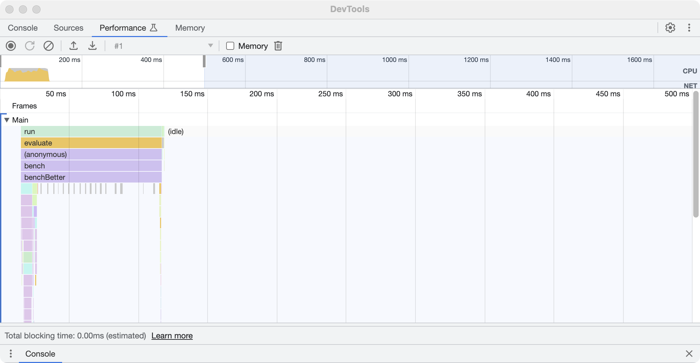
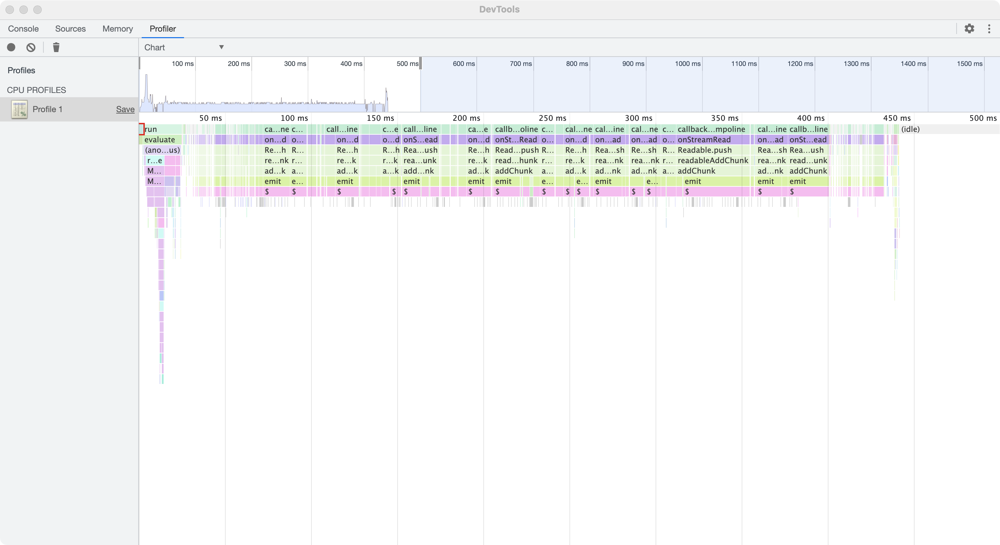
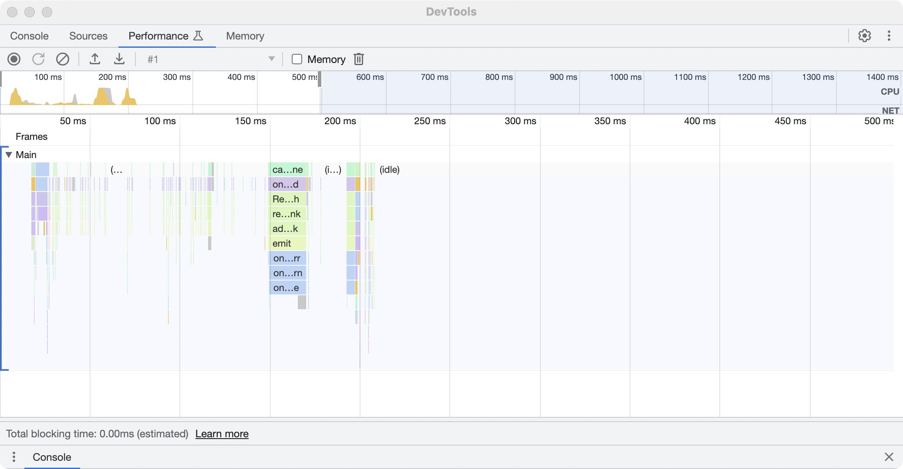

# Tiny SQLite3

A tiny cross-platform client for SQLite3, with [precompiled binaries](https://github.com/fabiospampinato/sqlite3-binaries) as the only third-party dependencies.

A nice feature about this library is that queries are processed in another process by SQLite3, so actually the main thread stays idle and able to perform work almost for the entire time, while `better-sqlite3` blocks.

## Install

```sh
npm install --save tiny-sqlite3
```

## Usage

```ts
import Database, {raw, sql} from 'tiny-sqlite3';

// Create an in-memory database

const mem = new Database ( ':memory:' );

// Create a permament on-disk database

const db = new Database ( 'foo.db' );

// Create a temporary on-disk database, which is automatically deleted when the database is closed

const temp = new Database ( '' );

// Create a database with custom options

const custom = new Database ( 'bar.db', {
  bin: 'sqlite3', // Path to the sqlite3 binary to use
  args: ['-bail'], // Extra arguments to use when creating a database
  page: 16_384, // Custom page size
  size: 1_000_000, // Maximum allowed size of the database, in bytes
  readonly: true, // Opening the database in read-only mode
  timeout: 60_000, // Maximum amount of time allowed for a query
  wal: true // Using the WAL journaling mode, rather than the default one
});

// Read the various properties attached to the database instance

db.path // => full path to the main file containing the data for the database, or ":memory:" if it's an in-memory database
db.memory // => whether it's in an in-memory database or not
db.readonly // => whether the database is opened in read-only mode or not
db.temporary // => whether it's a temporary database or not, temporary databases are automatically deleted from disk on close
db.batching // => whether queries are currently being executed in a batch or not
db.transacting // => whether a transaction is currently being executed or not

// Backup the whole database to a specific location, safer than manually coping files

await db.backup ( 'foo.db.bak' );

// Serialize the database to a Uint8Array, and create a new temporary database from that Uint8Array

const serialized = await db.serialize ();
const deserialized = new Database ( serialized );

// Perform an SQL query, interpolated values are escaped automatically

const limit = 1;
const rows = await db.sql`SELECT * FROM example LIMIT ${limit}`;

// Generate a query to execute later, with the standalone "sql" function

const query = sql`SELECT * FROM example LIMIT ${limit}`;

// Interpolate a raw, unescaped, string in a SQL query

const rows2 = await db.sql`SELECT * FROM ${db.raw ( 'example' )} LIMIT ${limit}`;

// Generate a raw value to interpolate later, with the standalone "raw" function

const rawValue = raw ( 'example' );

// Perform a query more manually, in various output modes
// Note how when performing a query manually interpolated values are not escaped automatically unless you use the "sql" function

const rowsParsed = await db.query ( 'SELECT * FROM example LIMIT 1' );
const rowsJSON = await db.query ( 'SELECT * FROM example LIMIT 1', 'json' );
const noOutput = await db.query ( 'SELECT * FROM example LIMIT 1', 'null' );

// Conveniently get some information about the database, using the ".dbinfo" command

const info = await db.info ();

// Conveniently get some statistics about the database, using the ".stats" command

const stats = await db.stats ();

// Dump the content of a database as a SQL string, using the ".dump" command

const dumped = await db.dump ();

// Recover as much data as possible from a corrupted database, using the ".recover" command

const recovered = await db.recover ();

// Get the PID of the underlying sqlite process, if any

const pid = db.pid ();

// Get the current size of the database

const size = await db.size ();

// Vacuum the database, shrinking its size by reducing fragmentation caused by deleted pages

await db.vacuum ();

// Start a batch, which will cause all queries to be executed as one, their output won't be available

await db.sql`CREATE TABLE example ( id INTEGER PRIMARY KEY, title TEXT, description TEXT )`;

await db.batch ( () => {
  db.sql`INSERT INTO example VALUES( ${101}, ${'title101'}, ${'description101'} )`;
  db.sql`INSERT INTO example VALUES( ${102}, ${'title102'}, ${'description102'} )`;
  db.sql`INSERT INTO example VALUES( ${103}, ${'title103'}, ${'description103'} )`;
});

// Start a transaction, which is executed immediately and rolled back automatically if the function passed to the "transaction" method throws at any point

const success = await db.transaction ( () => {
  await db.sql`INSERT INTO example VALUES( ${1}, ${'title1'}, ${'description1'} )`;
  await db.sql`INSERT INTO example VALUES( ${2}, ${'title2'}, ${'description2'} )`;
  await db.sql`INSERT INTO example VALUES( ${1}, ${'title1'}, ${'description1'} )`; // This will cause the transaction to be rolled back
});

console.log ( success ); // => true|false

// Transactions and batches can be combined together for greater performance

await db.transaction ( async () => {
  await db.batch ( () => {
    db.sql`INSERT INTO example VALUES( ${201}, ${'title201'}, ${'description201'} )`;
    db.sql`INSERT INTO example VALUES( ${202}, ${'title202'}, ${'description202'} )`;
    db.sql`INSERT INTO example VALUES( ${203}, ${'title203'}, ${'description203'} )`;
  });
});

// Close the connection to the database, from this point onwards no further queries can be executed

db.close ();
```

## Benchmark

Executing the benchmark provided in this repo generates the following flamecharts for different SQLite3 clients.

Basically `better-sqlite3` returns results faster, but it blocks for longer. Depending on your use case you may prefer one or the other.

### `better-sqlite3`



### `sqlite-tag-spawned`



### `tiny-sqlite3`



## Thanks

- [`sqlite-tag-spawned`](https://github.com/WebReflection/sqlite-tag-spawned): for providing a sort of reference implementation, `tiny-sqlite3` is very much derivative work of `sqlite-tag-spawned`.
- [`@WebReflection`](https://github.com/WebReflection): for also providing the idea of directly spawning the official prebuild binaries.

## License

- Parts: ISC © Andrea Giammarchi
- Parts: MIT © Fabio Spampinato
